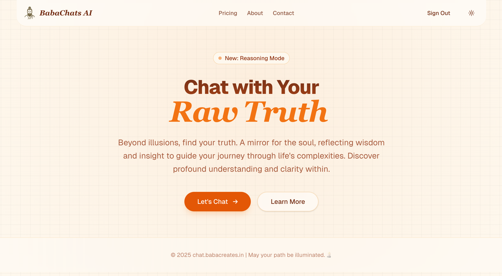

# BabaChats AI 🕉️



**BabaChats AI** is a spiritual AI companion designed to guide seekers on their journey of wisdom and enlightenment. Unlike standard AI assistants, BabaChats is tuned to provide thoughtful, culturally resonant, and spiritually grounded responses, helping users explore the depths of their consciousness.

## 🌟 Spiritual Journey

We believe in making wisdom accessible to everyone, regardless of where they are on their path.

- **Seeker (Free):** For those just starting their journey. Access to standard models and essential guidance.
- **Enlightened (Pro):** For the dedicated practitioner. Deeper insights, advanced reasoning models, and unlimited exploration.

## 🚀 Getting Started

This project is built with [Next.js](https://nextjs.org), and [PostgreSQL](https://www.postgresql.org). It is based on the Vercel AI Chat template.

### Prerequisites

- Node.js 22+
- pnpm
- PostgreSQL database

### Installation

1.  **Clone the repository:**

    ```bash
    git clone https://github.com/AnmolDotX/babachats-ai.git
    cd babachats-ai
    ```

2.  **Install dependencies:**

    ```bash
    pnpm install
    ```

3.  **Environment Setup:**
    Copy the example environment file and fill in your credentials:

    ```bash
    cp .env.example .env
    ```

    You will need:

    - `POSTGRES_URL`: Your database connection string.
    - `AUTH_SECRET`: Generate one with `openssl rand -base64 32`.
    - AI Provider Keys (e.g., `GOOGLE_GENERATIVE_AI_API_KEY`).

4.  **Database Setup:**
    Push the schema to your database:

    ```bash
    pnpm run db:migrate
    ```

5.  **Run Development Server:**
    ```bash
    pnpm run dev
    ```
    Open [http://localhost:3000](http://localhost:3000) to start your journey.

## 🛠️ Tech Stack

- **Framework:** Next.js 15 (App Router)
- **Database:** PostgreSQL (Drizzle ORM)
- **Auth:** NextAuth.js
- **Styling:** Tailwind CSS
- **Deployment:** Vercel

## 📞 Contact

Connect with the creator:

- **Twitter:** [AnmolDotX](https://twitter.com/AnmolDotX)
- **LinkedIn:** [AnmolDotX](https://www.linkedin.com/in/anmoldotx/)
- **Email:** [kumaranmol8611@gmail.com]
- **Phone:** [+91 6205993748]

---

_May your path be illuminated._ 🕯️
